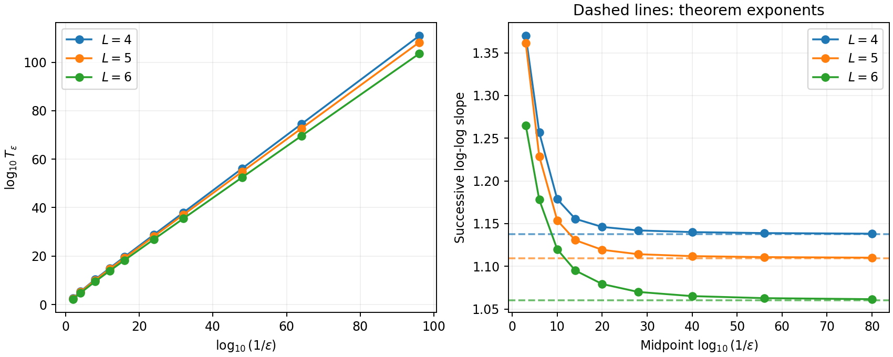

# Correction times for linear policy gradient on a coin line

**Rob Sneiderman** · Research preprint, 2026

[Read the paper](paper/coin-line-rates.pdf) ·
[Reproduce the results](REPRODUCING.md) ·
[Review record](STATUS.md) ·
[Download v0.1.0](https://github.com/Robby955/coin-line-policy-gradient/releases/tag/v0.1.0)

[](https://github.com/Robby955/coin-line-policy-gradient/actions/workflows/tests.yml)

How long can a policy keep choosing the wrong action on an unseen test state,
even when its training distribution contains examples that should correct it?
This paper gives matching upper and lower bounds for that time in the
[MAIS-A8 coin-line model](sources/MAIS-A8.tex), a three-parameter policy-gradient system.

**Correction becomes slower than inverse training diversity.**
As the diversity parameter $\varepsilon$ tends to zero, the first correction
time grows as a power of $1/\varepsilon$, with an explicit exponent greater
than one.

## Main result

Fix an integer $L\ge 4$. For exact Euclidean return-gradient flow from
**zero initialization**, the first probe-correction time satisfies

$$
T_\varepsilon=\Theta_L\left(\varepsilon^{-\alpha_L}\right)
\qquad (\varepsilon\downarrow 0),
$$

where

$$
\alpha_L=\frac{M}{M-n(L+1)-2r}>1,
$$

$$
n=\left\lceil\frac{L+1}{2}\right\rceil,
\qquad r=L+1-n,
\qquad M=n^2(1+L^2)+r^2.
$$

The upper and lower constants may depend on $L$. For example:

| Line length | Exact exponent | Approximate value |
|:---:|:---:|:---:|
| $L=4$ | $157/138$ | 1.137681 |
| $L=5$ | $81/73$ | 1.109589 |
| $L=6$ | $601/567$ | 1.059965 |



**Figure 1.** Left: first correction times from numerical integration. Right: successive
log–log slopes, with the theorem exponents dashed. Thirty retained runs cover
$\varepsilon=10^{-2}$ through $10^{-96}$; numerical evidence illustrates the
asymptotic result. The proof is in the paper.

## Model and proof

An agent moves on the sites $0,\ldots,L$, starts uniformly, and receives a
reward for reaching a coin within $2L$ actions. Its probability of moving
right is logistic in the position $p$ and coin location $c$, with logit
$a+bp+dc$. Training places most coins at the right endpoint; the remaining
mass is spread over coin locations $1,\ldots,L$. The test state places the
coin at zero and the agent at $\lceil L/2\rceil$.

The proof has three steps:

1. **Find the zero-diversity trajectory.** A logarithmic asymptotic expansion
   identifies the direction in which training drives the parameters.
2. **Bound the time before correction.** A one-sided Hessian estimate controls
   how long a small positive diversity tracks that trajectory.
3. **Prove correction on the same time scale.** Failed-path expansions remain
   valid as the position coefficient changes sign. A ratio barrier then
   controls the trajectory through to the first probe crossing.

This is a quantitative follow-up to the qualitative result discussed in
[MAIS-O87, issue #35](https://github.com/lionellevine/MAIS/issues/35).
The rate theorem concerns the **first correction from zero initialization**;
random initialization, permanent correction, and discrete or sampled updates
are outside its scope.

## Code and reproducibility

The companion computes the exact finite-horizon return and gradient by
Bellman recursion. Tests compare them against independent rational path
enumeration and check the finite algebra used in the proof. The retained
experiments include solver comparisons and 180-digit gradient checks.

With Python 3.13, from the repository root:

```sh
python3 -m venv .venv
. .venv/bin/activate
python -m pip install -r requirements.txt
python -m unittest discover -v
```

The [reproduction guide](REPRODUCING.md) gives the experiment commands,
paper build instructions, and a map from each check to its retained results.

| Resource | Contents |
|:---|:---|
| [Paper](paper/coin-line-rates.pdf) · [LaTeX source](paper/coin-line-rates.tex) | Theorem statements and complete proofs |
| [Model](model.py) · [Correction-time driver](correction_time.py) | Exact return, gradient, and flow integration |
| [Results](results/) · [Figures](output/figures/) | Retained numerical outputs and scaling plots |
| [Review status](STATUS.md) | Review scope, reports, and remaining limitations |
| [Source provenance](sources/receipt.json) · [File hashes](MANIFEST.json) | Pinned upstream model and artifact checksums |

## Citation and license

Rob Sneiderman. *Correction times for linear policy gradient on a coin line.*
Preprint, 2026. [Version 0.1.0](https://github.com/Robby955/coin-line-policy-gradient/releases/tag/v0.1.0).

Citation metadata is available in [CITATION.cff](CITATION.cff).
Code is licensed under [MIT](LICENSE); the paper, figures, and original result
data under [CC BY 4.0](LICENSE-paper). See [licensing and attribution](LICENSING.md)
for the upstream source terms.
